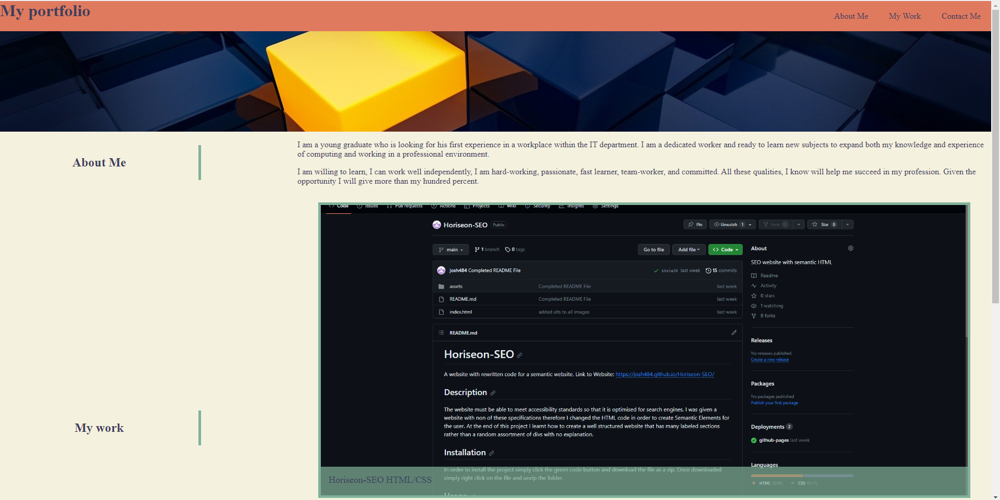
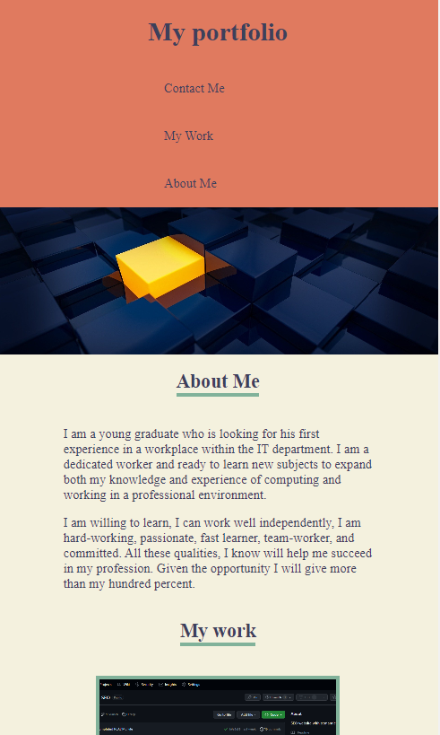

# my-portfolio
A portfolio of my coding work.
https://github.com/josh484/my-portfolio
## Description 
The website is a portfolio of the work I have done, it is a work in progress and will be updated with more of my work once I do them. The website contains all that I have learnt on week two of the bootcamp and highlights my css skills especially through the use of Flexbox and Grid spread throughout the page. The page is of course also using what I have learnt in week one and contains semantic tags. 

At the end of this project I am more confident in my css skills and know how to use flexbox and grid for css as well as media queries. 
## Installation
In order to install the project simply click the green code button and download the file as a zip. 
Once downloaded simply right click on the file and unzip the folder.
## Usage 
Once the file is downloaded you can open the index.html on your web browser you will be met with this page:

For Those who are using a phone you may be met with this page instead:

The buttons at the right serve as the guide for sections of the page (Top Right for Computer users). 
Each Image link/will link to a project that I have done for now it is only the first one that will do so.

## Features
Here are a list of features for my website.

- Navigation Buttons at the top will link you to sections of the page
- The body itself is a flexbox that wraps everything as a column so that objects vertically flow down.
- There is a container flexbox for the main content that wraps as a row and left side objects are 30% of the row(Titles) while right side objects cover 70%(Information/Pictures) so that there is a title for each bits of information.
- The My Work Section Contains a Grid which highlights all of the work that I have done and links to their respective repository.
- When viewed on a mobile phone header becomes a flexbox that wraps the navigation as a column.
- The flexbox for the main content becomes a column wrap to fit everything on one column for better scrolling on phones. The Grid also displays images in a column.

